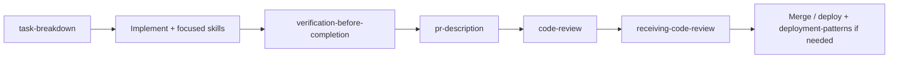

# Universal AI Skills Pack

Skills that help agents carry routine work from start to finish, with explicit handoffs when a human should decide. Use them with Claude, ChatGPT, Cursor, Codex, and any assistant that supports the [Agent Skills](https://agentskills.io) format.

## Table of contents

- [Universal AI Skills Pack](#universal-ai-skills-pack)
  - [Table of contents](#table-of-contents)
  - [What is this?](#what-is-this)
  - [Skills index](#skills-index)
  - [Usage examples](#usage-examples)
  - [Typical workflow](#typical-workflow)
  - [Patterns for best results](#patterns-for-best-results)
  - [Install](#install)
    - [Cursor](#cursor)
    - [Claude Code / Codex](#claude-code--codex)
    - [Any Agent Skills-compatible tool](#any-agent-skills-compatible-tool)
  - [Compatibility](#compatibility)
  - [Philosophy](#philosophy)
  - [License](#license)

---

## What is this?

**25+ core skills** for AI coding assistants. The idea is to give teams:

- A path from "not started" to "actually done" on repetitive work, with less back-and-forth than ad-hoc prompts
- The same conventions across repos, stacks, and time zones
- A shared way to handle code review, docs, security checks, and releases without hiring a person for each lane

It is a small, opinionated set: code quality, safety, documentation, releases, and workflow glue. The agent handles the boring steps; people keep ownership of tradeoffs and risk.

---

## Skills index

| #   | Skill                              | When to use                                                                  |
| --- | ---------------------------------- | ---------------------------------------------------------------------------- |
| 1   | **code-review**                    | Review PRs for correctness, security, and team standards                     |
| 2   | **commit-messages**                | Generate conventional commit messages from staged diffs                      |
| 3   | **coding-standards**               | Enforce naming, structure, and patterns (TS/JS, style, APIs)                 |
| 4   | **test-driven-development**        | Write tests first, then implementation; red-green-refactor                   |
| 5   | **documentation**                  | README, API docs, runbooks, and in-code docs                                 |
| 6   | **api-design**                     | Design REST/GraphQL APIs with consistency and versioning                     |
| 7   | **database-migrations**            | Safe schema changes, rollback, and migration hygiene                         |
| 8   | **systematic-debugging**           | Reproduce → isolate → fix → verify; no random edits                          |
| 9   | **security-audit**                 | Check for injection, secrets, auth, and common vulns                         |
| 10  | **changelog-release-notes**        | Changelogs and release notes from commits/tags                               |
| 11  | **task-breakdown**                 | Break epics into subtasks with acceptance criteria                           |
| 12  | **pr-description**                 | PR title and description from branch and diff                                |
| 13  | **accessibility-audit**            | WCAG-oriented a11y checks and fixes                                          |
| 14  | **dependency-updates**             | Safe dependency upgrades and breaking-change review                          |
| 15  | **env-and-config**                 | .env.example, config docs, and env var hygiene                               |
| 16  | **error-handling-patterns**        | Consistent errors, logging, and user-facing messages                         |
| 17  | **git-workflow**                   | Branch naming, merge strategy, and cleanup                                   |
| 18  | **refactoring-safely**             | Small steps, tests, no behavior change                                       |
| 19  | **logging-standards**              | Structured logging, levels, and PII handling                                 |
| 20  | **codebase-exploration**           | Map and navigate unfamiliar codebases quickly                                |
| 21  | **runbook-incident**               | Runbooks and incident response steps                                         |
| 22  | **openapi-spec**                   | Create and maintain OpenAPI/Swagger specs from code or design                |
| 23  | **verification-before-completion** | Run verification (tests/build) and cite output before claiming done          |
| 24  | **receiving-code-review**          | Verify feedback, clarify unclear items, push back with reasoning when needed |
| 25  | **deployment-patterns**            | Deploy strategies, health checks, rollback, production readiness (any stack) |

---

## Usage examples

These are **natural-language** patterns; your tool may also expose skills as rules, `/commands`, or plugins-phrase the same intent there.

**Gate before "done"**

- "Apply **verification-before-completion**: run the project's test and build commands in this session, paste the relevant output, then say whether it passes. Do not claim done before that."

**Review flow**

- "Use **code-review** on the diff against `main`: Critical / Suggestions / Nice to have, with file:line references."
- "Here are review comments-use **receiving-code-review** to draft replies where we agree, ask for clarification, or push back with evidence."

**Planning and shipping**

- "**task-breakdown**: split [feature] into subtasks with acceptance criteria and dependencies."
- "Then **pr-description** for this branch vs `main`; include What / How / Testing."

**Quality and safety**

- "**systematic-debugging** for this error: reproduce, root cause only after Phase 1-[paste logs]."
- "**security-audit** on files touched by this change (auth, injection, secrets)."

**Typical day (combined)**

- "Plan with **task-breakdown**, implement, then **verification-before-completion**, then **pr-description**, then **code-review** before merge."

---

## Typical workflow

End-to-end habit (adjust names to your process):

Not every task uses every step; **verification-before-completion** is the usual gate before claiming finished work or opening a PR.

---

## Patterns for best results

These skills borrow patterns from strong real-world packs so outcomes stay consistent and checkable. If you author or fork skills, read **[docs/PATTERNS.md](docs/PATTERNS.md)** first (Iron Law, phased work with clear "done," rationalization tables, red flags, verification gates, how skills chain, templates).

The skills themselves are written to be stack-agnostic where it makes sense, with room to ask questions or adapt when the repo does not match the example.

Useful pieces from that doc:

- **Iron law** - One non-negotiable rule per skill when it matters (for example: no "done" without verification).
- **Phases and success criteria** - Finish phase N before N+1; say what finished looks like at each step.
- **Rationalizations table** - Excuse in one column, plain answer in the other so nobody skips steps on autopilot.
- **Red flags / STOP** - When to stop and rerun or re-verify instead of pushing through.
- **Verification gate** - Run the command that proves the claim, read the output, then speak (see **verification-before-completion**).
- **Integration** - How skills line up (e.g. task-breakdown → implement → verify → pr-description → code-review → receiving-code-review).

---

## Install

### Cursor

- **Project-level:** Copy the `skills/` folder into your repo as `.cursor/skills/` or `.agents/skills/`.
- **User-level:** Copy into `~/.cursor/skills/`.
- Or add this repo as a **Remote Rule (GitHub)** in Cursor Settings → Rules and point to this repo's `skills/` path.

### Claude Code / Codex

- Copy `skills/` into `.claude/skills/` or `.codex/skills/` (project or user home).
- Same folder layout: each skill is a directory with a `SKILL.md` file.

### Any Agent Skills-compatible tool

- Use the [Agent Skills](https://agentskills.io) layout: each skill = folder with `SKILL.md`.
- Place the contents of `skills/` in your tool's skill directory (see its docs).

---

## Compatibility

- **Format:** [Agent Skills](https://agentskills.io) open standard (SKILL.md + optional `scripts/`, `references/`, `assets/`).
- **Platforms:** Cursor, Claude Code, Codex, and any agent that discovers skills from directories.
- **Languages:** Skills aim to be stack-agnostic where possible; some (e.g. coding-standards, api-design) include TypeScript/JavaScript examples you can swap for your language.

---

## Philosophy

1. **Universal** - Backend, frontend, platform, data: the same habits can travel.
2. **Autonomous** - Tasks are scoped so an agent can run them end-to-end, with explicit "ask a human" exits when the repo or risk profile demands it.
3. **Few, not many** - Roughly two dozen skills cover the repeated grunt work; we avoid a hundred micro-skills nobody remembers.
4. **Portable** - One pack works across tools; you are not locked to a single vendor.
5. **Ops-shaped** - Written with distributed teams in mind: can you ship consistent quality and documentation without review on every line? These skills aim to make that more realistic, not magic.

---

## License

[MIT](LICENSE).
